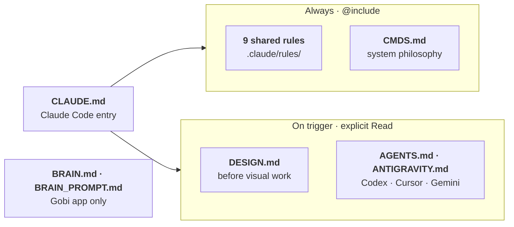

```mermaid
flowchart LR
%% @name: arch-load-en
%% @alt: CLAUDE.md is the entry Claude Code opens. It always includes the nine shared rules and CMDS.md; DESIGN, AGENTS and ANTIGRAVITY are read on trigger; BRAIN and BRAIN_PROMPT are read only by the Gobi app.
%% @key: CL
%% @aux: BR
  CL["`**CLAUDE.md**
Claude Code entry`"]
  BR["`**BRAIN.md · BRAIN_PROMPT.md**
Gobi app only`"]
  subgraph ALWAYS["Always · @include"]
    R["`**9 shared rules**
.claude/rules/`"]
    CM["`**CMDS.md**
system philosophy`"]
  end
  subgraph TRIG["On trigger · explicit Read"]
    D["`**DESIGN.md**
before visual work`"]
    AA["`**AGENTS.md · ANTIGRAVITY.md**
Codex · Cursor · Gemini`"]
  end
  CL --> ALWAYS
  CL --> TRIG
```
*CLAUDE.md is the single entry: the nine shared rules and CMDS.md load every session, DESIGN, AGENTS and ANTIGRAVITY are read on trigger, and the two BRAIN files are read only by the Gobi app.*
