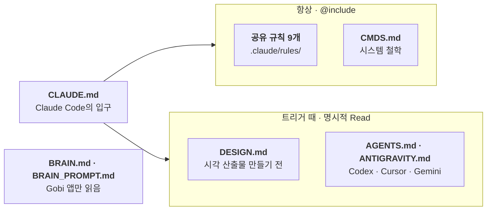

```mermaid
flowchart LR
%% @name: arch-load-ko
%% @alt: CLAUDE.md는 Claude Code가 여는 입구다. 공유 규칙 9개와 CMDS.md는 항상 포함되고, DESIGN·AGENTS·ANTIGRAVITY는 트리거 때 읽으며, BRAIN과 BRAIN_PROMPT는 Gobi 앱만 읽는다.
%% @key: CL
%% @aux: BR
  CL["`**CLAUDE.md**
Claude Code의 입구`"]
  BR["`**BRAIN.md · BRAIN_PROMPT.md**
Gobi 앱만 읽음`"]
  subgraph ALWAYS["항상 · @include"]
    R["`**공유 규칙 9개**
.claude/rules/`"]
    CM["`**CMDS.md**
시스템 철학`"]
  end
  subgraph TRIG["트리거 때 · 명시적 Read"]
    D["`**DESIGN.md**
시각 산출물 만들기 전`"]
    AA["`**AGENTS.md · ANTIGRAVITY.md**
Codex · Cursor · Gemini`"]
  end
  CL --> ALWAYS
  CL --> TRIG
```
*입구는 CLAUDE.md 하나이며, 공유 규칙 9개와 CMDS.md는 매 세션 자동으로 들어오고, DESIGN·AGENTS·ANTIGRAVITY는 트리거 때 읽으며, BRAIN 두 파일은 Gobi 앱만 읽습니다.*
