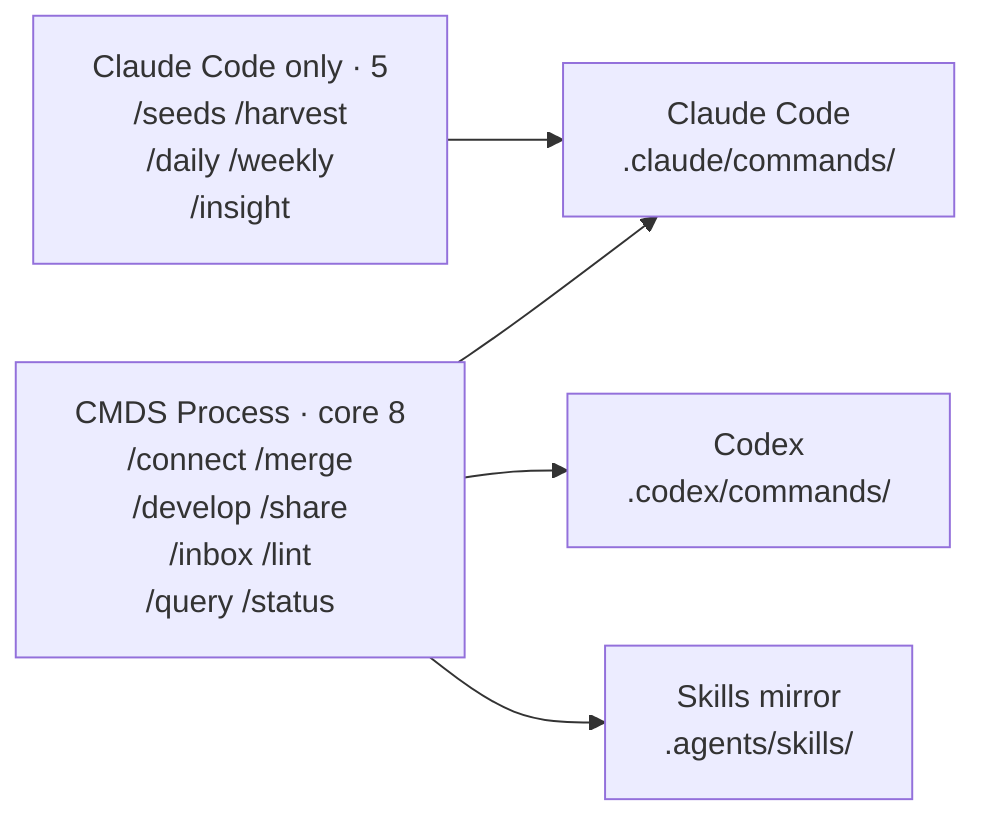

```mermaid
flowchart LR
%% @name: commands-parity-en
%% @alt: The eight core CMDS Process commands point to three harness folders, .claude/commands, .codex/commands and .agents/skills; five Claude Code only commands point to .claude/commands alone.
%% @key: C8
	C8["CMDS Process · core 8<br>/connect /merge<br>/develop /share<br>/inbox /lint<br>/query /status"]
	O5["Claude Code only · 5<br>/seeds /harvest<br>/daily /weekly<br>/insight"]
	HC["Claude Code<br>.claude/commands/"]
	HX["Codex<br>.codex/commands/"]
	HA["Skills mirror<br>.agents/skills/"]
	C8 --> HC
	C8 --> HX
	C8 --> HA
	O5 --> HC
```
*Eight operating commands are mirrored in all three harnesses; five are Claude Code only.*
