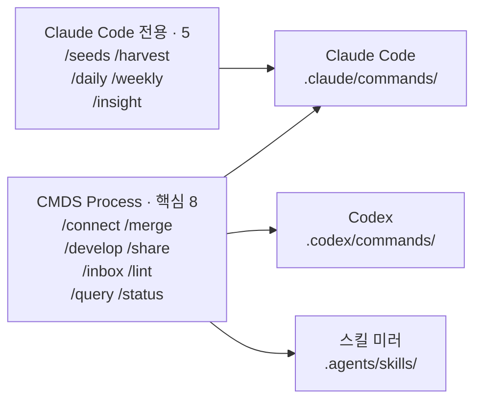

```mermaid
flowchart LR
%% @name: commands-parity-ko
%% @alt: CMDS Process 핵심 커맨드 8개는 세 하네스 폴더(.claude/commands, .codex/commands, .agents/skills)로 이어지고, Claude Code 전용 5개는 .claude/commands 하나로만 이어진다.
%% @key: C8
	C8["CMDS Process · 핵심 8<br>/connect /merge<br>/develop /share<br>/inbox /lint<br>/query /status"]
	O5["Claude Code 전용 · 5<br>/seeds /harvest<br>/daily /weekly<br>/insight"]
	HC["Claude Code<br>.claude/commands/"]
	HX["Codex<br>.codex/commands/"]
	HA["스킬 미러<br>.agents/skills/"]
	C8 --> HC
	C8 --> HX
	C8 --> HA
	O5 --> HC
```
*운영 커맨드 8개는 세 하네스에 모두 있고, 5개는 Claude Code 전용입니다.*
