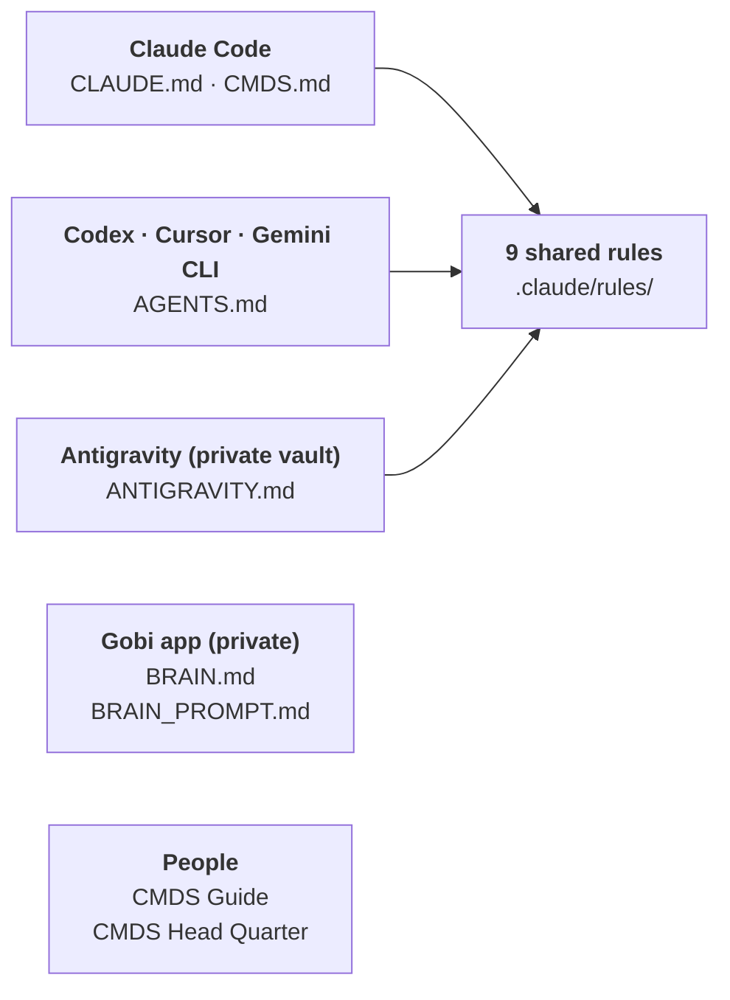

```mermaid
flowchart LR
%% @name: load-swimlane-en
%% @alt: Five readers, each with its own files. Claude Code reads CLAUDE.md and CMDS.md. Codex, Cursor and Gemini CLI read AGENTS.md. Antigravity, inside the private vault, reads ANTIGRAVITY.md. The Gobi app reads BRAIN.md and BRAIN_PROMPT.md. People read CMDS Guide and CMDS Head Quarter. Only the nine shared rules are common to the first three.
%% @key: claude, agents
%% @aux: anti, brain
  claude["`**Claude Code**
CLAUDE.md · CMDS.md`"]
  agents["`**Codex · Cursor · Gemini CLI**
AGENTS.md`"]
  anti["`**Antigravity (private vault)**
ANTIGRAVITY.md`"]
  brain["`**Gobi app (private)**
BRAIN.md
BRAIN_PROMPT.md`"]
  people["`**People**
CMDS Guide
CMDS Head Quarter`"]
  rules["`**9 shared rules**
.claude/rules/`"]
  claude --> rules
  agents --> rules
  anti --> rules
```
*Each reader has its own entry file; only the nine rules are shared.*
