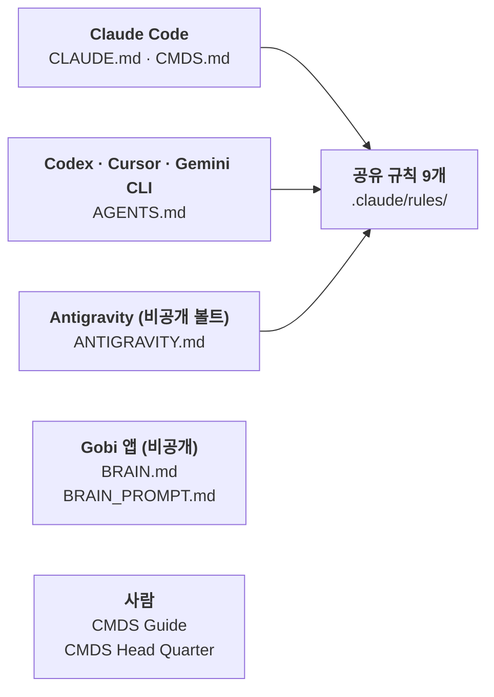

```mermaid
flowchart LR
%% @name: load-swimlane-ko
%% @alt: 독자 다섯이 각자 다른 파일을 읽는다. Claude Code는 CLAUDE.md와 CMDS.md를, Codex·Cursor·Gemini CLI는 AGENTS.md를, 비공개 볼트 안의 Antigravity는 ANTIGRAVITY.md를, Gobi 앱은 BRAIN.md와 BRAIN_PROMPT.md를, 사람은 CMDS Guide와 CMDS Head Quarter를 읽는다. 규칙 9개만 앞의 셋이 공유한다.
%% @key: claude, agents
%% @aux: anti, brain
  claude["`**Claude Code**
CLAUDE.md · CMDS.md`"]
  agents["`**Codex · Cursor · Gemini CLI**
AGENTS.md`"]
  anti["`**Antigravity (비공개 볼트)**
ANTIGRAVITY.md`"]
  brain["`**Gobi 앱 (비공개)**
BRAIN.md
BRAIN_PROMPT.md`"]
  people["`**사람**
CMDS Guide
CMDS Head Quarter`"]
  rules["`**공유 규칙 9개**
.claude/rules/`"]
  claude --> rules
  agents --> rules
  anti --> rules
```
*독자마다 입구 파일이 다르고, 규칙 9개만 공유합니다.*
