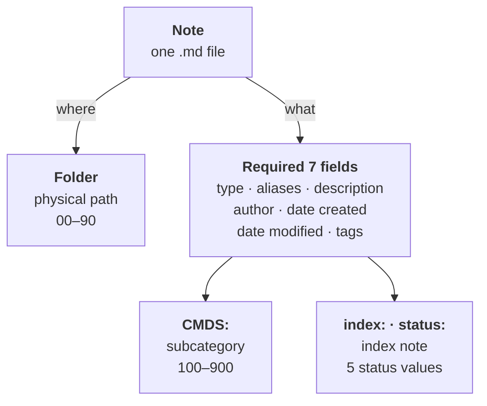

```mermaid
flowchart TD
%% @name: note-metadata-en
%% @alt: A note has two independent axes. Its folder says where it lives. Its frontmatter says what it is: seven required fields, then the optional CMDS field pointing to a subcategory, plus index and status.
%% @key: C
%% @aux: F
  N["`**Note**
one .md file`"] -->|"where"| F["`**Folder**
physical path
00–90`"]
  N -->|"what"| R["`**Required 7 fields**
type · aliases · description
author · date created
date modified · tags`"]
  R --> C["`**CMDS:**
subcategory
100–900`"]
  R --> X["`**index: · status:**
index note
5 status values`"]
```
*Folder and CMDS: are different axes: the folder says where a note lives, the frontmatter says what it is.*
