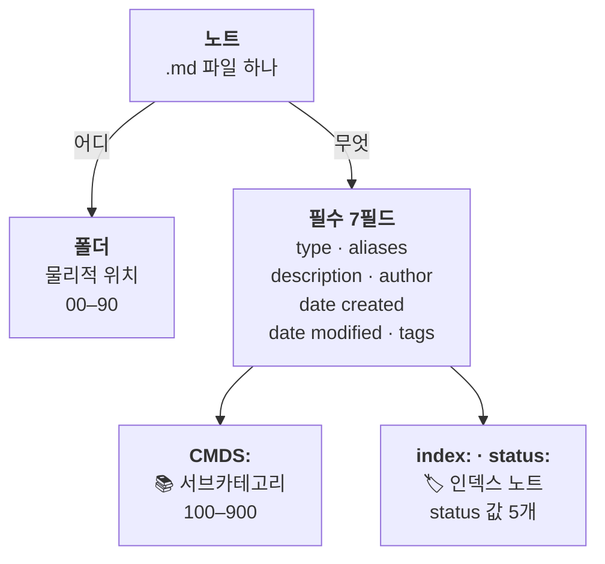

```mermaid
flowchart TD
%% @name: note-metadata-ko
%% @alt: 노트에는 독립된 두 축이 있다. 폴더는 어디 있는지를 말하고, 프론트매터는 무엇인지를 말한다. 필수 7필드 다음에 서브카테고리를 가리키는 선택 필드 CMDS와 index, status가 온다.
%% @key: C
%% @aux: F
  N["`**노트**
.md 파일 하나`"] -->|"어디"| F["`**폴더**
물리적 위치
00–90`"]
  N -->|"무엇"| R["`**필수 7필드**
type · aliases
description · author
date created
date modified · tags`"]
  R --> C["`**CMDS:**
📚 서브카테고리
100–900`"]
  R --> X["`**index: · status:**
🏷 인덱스 노트
status 값 5개`"]
```
*폴더와 CMDS:는 다른 축입니다. 폴더는 노트가 어디 있는지를, 프론트매터는 노트가 무엇인지를 말합니다.*
