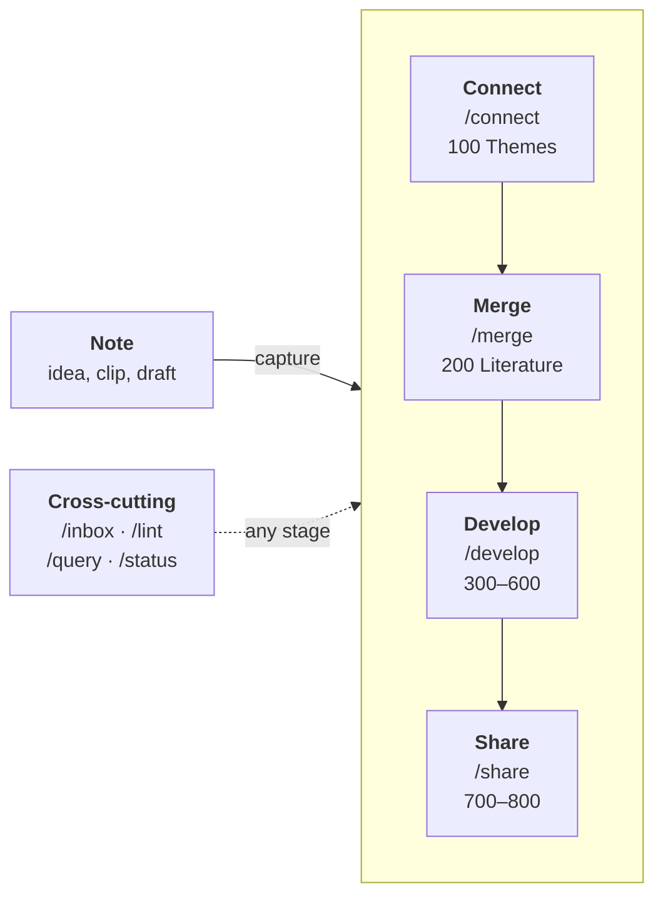

```mermaid
flowchart LR
%% @name: process-flow-en
%% @alt: A note enters the CMDS Process and passes four stages in order, Connect, Merge, Develop and Share; each stage shows its command and category range. Cross-cutting commands reach any stage.
%% @aux: X
  N["`**Note**
idea, clip, draft`"] -->|"capture"| P
  X["`**Cross-cutting**
/inbox · /lint
/query · /status`"] -.->|"any stage"| P
  subgraph P[" "]
    direction TB
    C["`**Connect**
/connect
100 Themes`"] --> M["`**Merge**
/merge
200 Literature`"]
    M --> D["`**Develop**
/develop
300–600`"]
    D --> S["`**Share**
/share
700–800`"]
  end
```
*A note moves through four stages, Connect, Merge, Develop and Share, and each stage has one command and one category range.*
