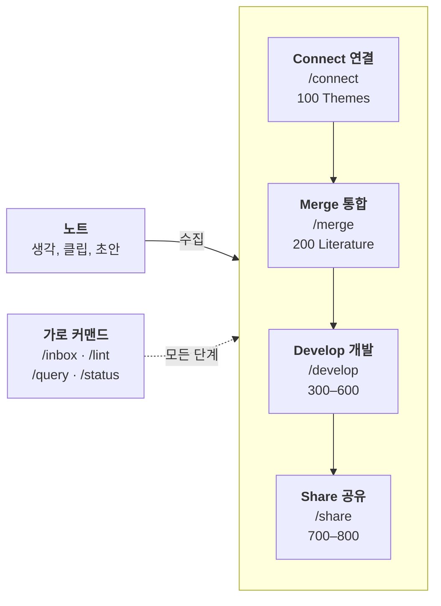

```mermaid
flowchart LR
%% @name: process-flow-ko
%% @alt: 노트는 CMDS Process에 들어와 Connect, Merge, Develop, Share 네 단계를 차례로 지나며, 단계마다 커맨드와 카테고리 범위가 적혀 있다. 가로 커맨드는 어느 단계에나 닿는다.
%% @aux: X
  N["`**노트**
생각, 클립, 초안`"] -->|"수집"| P
  X["`**가로 커맨드**
/inbox · /lint
/query · /status`"] -.->|"모든 단계"| P
  subgraph P[" "]
    direction TB
    C["`**Connect 연결**
/connect
100 Themes`"] --> M["`**Merge 통합**
/merge
200 Literature`"]
    M --> D["`**Develop 개발**
/develop
300–600`"]
    D --> S["`**Share 공유**
/share
700–800`"]
  end
```
*노트는 Connect, Merge, Develop, Share 네 단계를 지나며, 단계마다 커맨드 하나와 카테고리 범위 하나가 있습니다.*
