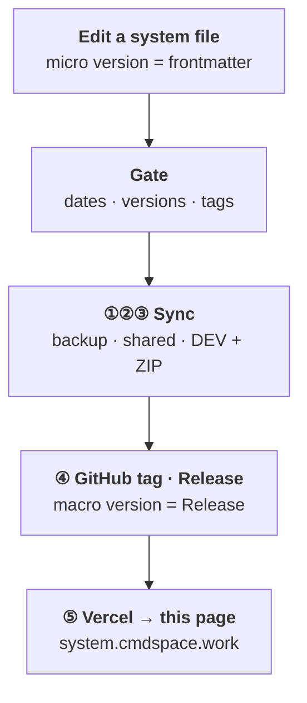

```mermaid
flowchart TD
  %% @name: release-flow-en
  %% @alt: Editing a system file in the vault passes a gate, is synced to backup, shared and DEV copies, pushed to GitHub with a tag and Release, and deployed by Vercel to system.cmdspace.work. Versions live on two layers: the micro version in each file's frontmatter, the macro version in CHANGELOG and the GitHub Release.
  %% @key: G, SITE
  E["`**Edit a system file**
micro version = frontmatter`"] --> G["`**Gate**
dates · versions · tags`"]
  G --> SYNC["`**①②③ Sync**
backup · shared · DEV + ZIP`"]
  SYNC --> GH["`**④ GitHub tag · Release**
macro version = Release`"]
  GH --> SITE["`**⑤ Vercel → this page**
system.cmdspace.work`"]
```
*One edit in the vault passes a gate, is synced to three local copies, then ships through GitHub and Vercel to this page; versions live on two layers, micro per file and macro per release.*
