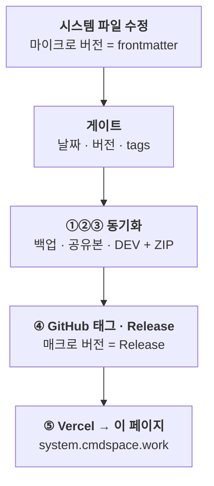

```mermaid
flowchart TD
  %% @name: release-flow-ko
  %% @alt: 볼트에서 시스템 파일을 고치면 게이트를 지나 백업·공유·DEV 사본으로 동기화되고, GitHub 에 태그·Release 된 뒤 Vercel 이 system.cmdspace.work 에 배포한다. 버전은 두 층으로, 마이크로 버전은 각 파일 frontmatter 에, 매크로 버전은 CHANGELOG 와 GitHub Release 에 있다.
  %% @key: G, SITE
  E["`**시스템 파일 수정**
마이크로 버전 = frontmatter`"] --> G["`**게이트**
날짜 · 버전 · tags`"]
  G --> SYNC["`**①②③ 동기화**
백업 · 공유본 · DEV + ZIP`"]
  SYNC --> GH["`**④ GitHub 태그 · Release**
매크로 버전 = Release`"]
  GH --> SITE["`**⑤ Vercel → 이 페이지**
system.cmdspace.work`"]
```
*볼트에서 고친 시스템 파일 하나가 게이트를 지나 세 곳에 동기화되고, GitHub 와 Vercel 을 거쳐 이 페이지가 됩니다. 버전은 파일별 마이크로와 릴리스별 매크로, 두 층으로 관리합니다.*
