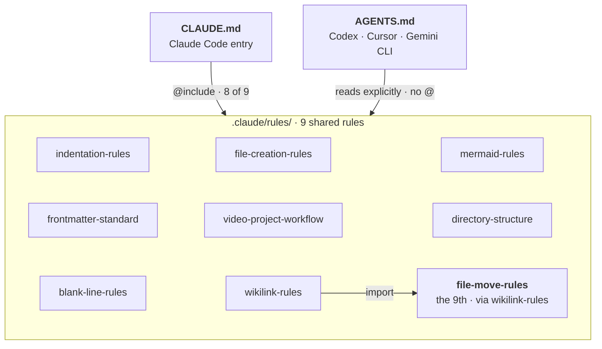

```mermaid
flowchart TD
%% @name: rules-include-en
%% @alt: CLAUDE.md includes eight of the nine shared rules in .claude/rules/ with @include; the ninth, file-move-rules, is imported inside wikilink-rules; AGENTS.md readers (Codex, Cursor, Gemini CLI) read all nine explicitly.
%% @key: CL
%% @aux: AG
  CL["`**CLAUDE.md**
Claude Code entry`"]
  AG["`**AGENTS.md**
Codex · Cursor · Gemini CLI`"]
  subgraph FOLDER[".claude/rules/ · 9 shared rules"]
    R1["indentation-rules"]
    R2["frontmatter-standard"]
    R4["blank-line-rules"]
    R5["file-creation-rules"]
    R6["video-project-workflow"]
    R3["wikilink-rules"]
    R7["mermaid-rules"]
    R8["directory-structure"]
    R9["`**file-move-rules**
the 9th · via wikilink-rules`"]
    R1 ~~~ R5 ~~~ R7
    R2 ~~~ R6 ~~~ R8
    R4 ~~~ R3
    R3 -->|"import"| R9
  end
  CL -->|"@include · 8 of 9"| FOLDER
  AG -->|"reads explicitly · no @"| FOLDER
```
*The nine shared rules live in one folder: CLAUDE.md pulls eight in with @include, wikilink-rules imports the ninth, and other agents read the folder explicitly.*
