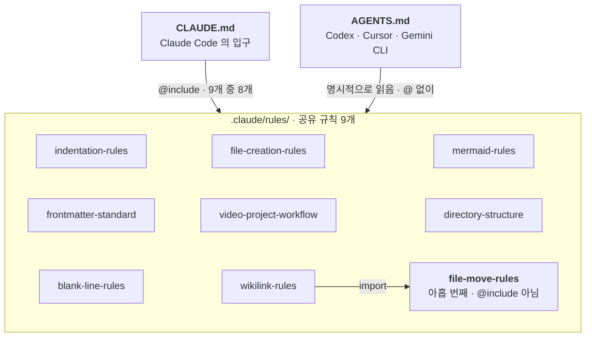

```mermaid
flowchart TD
%% @name: rules-include-ko
%% @alt: CLAUDE.md 는 .claude/rules/ 의 공유 규칙 9개 중 8개를 @include 로 읽고, 아홉 번째 file-move-rules 는 wikilink-rules 안에서 import 되며, AGENTS.md 를 쓰는 Codex·Cursor·Gemini CLI 는 9개를 명시적으로 읽는다.
%% @key: CL
%% @aux: AG
  CL["`**CLAUDE.md**
Claude Code 의 입구`"]
  AG["`**AGENTS.md**
Codex · Cursor · Gemini CLI`"]
  subgraph FOLDER[".claude/rules/ · 공유 규칙 9개"]
    R1["indentation-rules"]
    R2["frontmatter-standard"]
    R4["blank-line-rules"]
    R5["file-creation-rules"]
    R6["video-project-workflow"]
    R3["wikilink-rules"]
    R7["mermaid-rules"]
    R8["directory-structure"]
    R9["`**file-move-rules**
아홉 번째 · @include 아님`"]
    R1 ~~~ R5 ~~~ R7
    R2 ~~~ R6 ~~~ R8
    R4 ~~~ R3
    R3 -->|"import"| R9
  end
  CL -->|"@include · 9개 중 8개"| FOLDER
  AG -->|"명시적으로 읽음 · @ 없이"| FOLDER
```
*규칙 9개는 한 폴더에 있습니다. CLAUDE.md 가 8개를 @include 로 끌어오고, wikilink-rules 가 아홉 번째를 import 하며, 다른 에이전트는 폴더를 명시적으로 읽습니다.*
