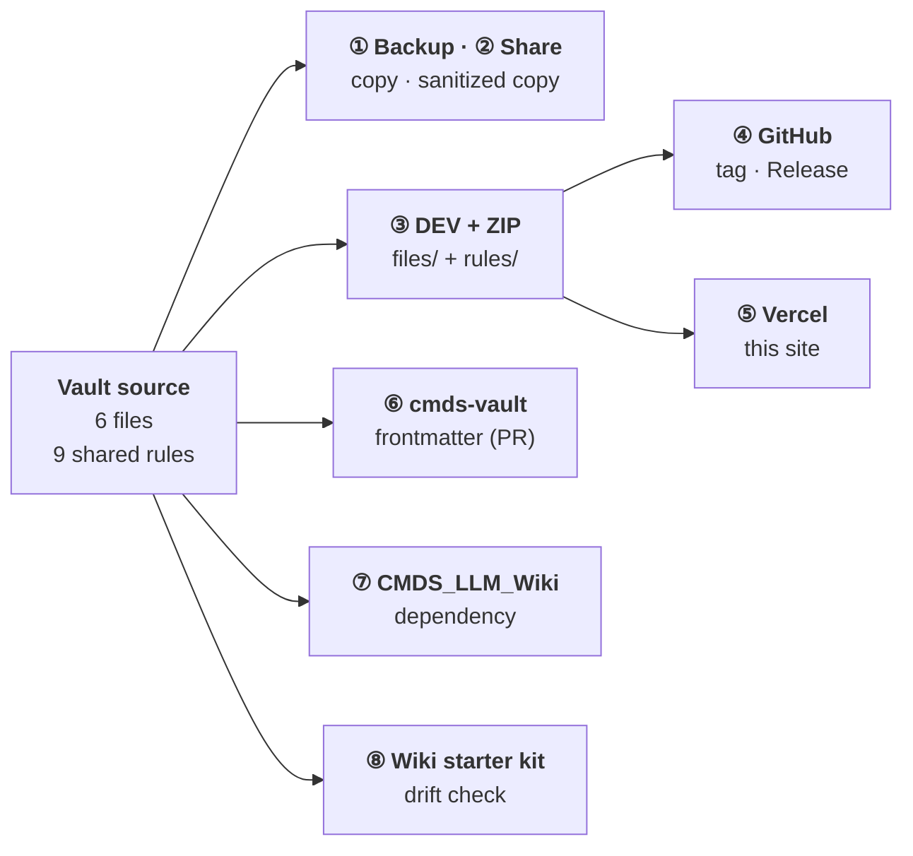

```mermaid
flowchart LR
%% @name: sync-fanout-en
%% @alt: One vault source fans out to eight destinations: a backup and a sanitized share copy in the vault, the DEV folder with ZIP, and from that folder a GitHub push with tag and Release and the Vercel deploy that serves this site; three satellites, cmds-vault, CMDS_LLM_Wiki and the LLM Wiki starter kit, are checked for drift.
%% @key: V, B5
%% @aux: S6, S7, S8
  V["`**Vault source**
6 files
9 shared rules`"]
  B12["`**① Backup · ② Share**
copy · sanitized copy`"]
  B3["`**③ DEV + ZIP**
files/ + rules/`"]
  B4["`**④ GitHub**
tag · Release`"]
  B5["`**⑤ Vercel**
this site`"]
  S6["`**⑥ cmds-vault**
frontmatter (PR)`"]
  S7["`**⑦ CMDS_LLM_Wiki**
dependency`"]
  S8["`**⑧ Wiki starter kit**
drift check`"]
  V --> B12
  V --> B3
  B3 --> B4
  B3 --> B5
  V --> S6
  V --> S7
  V --> S8
```
*One vault source fans out to eight destinations, and this site is the fifth.*
