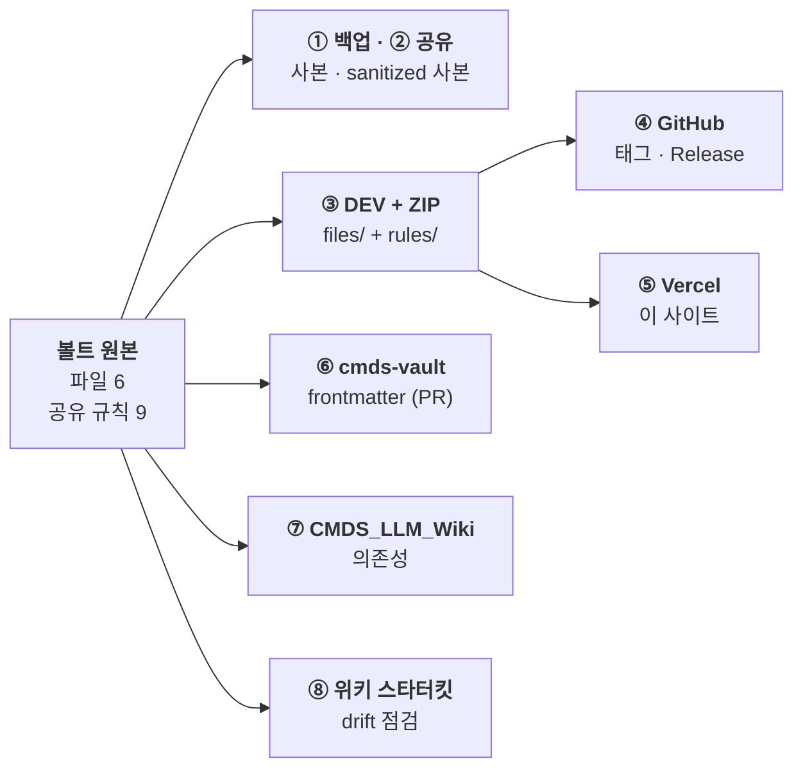

```mermaid
flowchart LR
%% @name: sync-fanout-ko
%% @alt: 볼트 원본 하나가 여덟 곳으로 퍼진다: 볼트 안 백업과 sanitized 공유본, DEV 폴더와 ZIP, 그 폴더에서 나가는 태그·Release 붙인 GitHub push와 이 사이트를 띄우는 Vercel 배포, 그리고 drift를 점검하는 위성 셋 cmds-vault·CMDS_LLM_Wiki·LLM Wiki 스타터킷.
%% @key: V, B5
%% @aux: S6, S7, S8
  V["`**볼트 원본**
파일 6
공유 규칙 9`"]
  B12["`**① 백업 · ② 공유**
사본 · sanitized 사본`"]
  B3["`**③ DEV + ZIP**
files/ + rules/`"]
  B4["`**④ GitHub**
태그 · Release`"]
  B5["`**⑤ Vercel**
이 사이트`"]
  S6["`**⑥ cmds-vault**
frontmatter (PR)`"]
  S7["`**⑦ CMDS_LLM_Wiki**
의존성`"]
  S8["`**⑧ 위키 스타터킷**
drift 점검`"]
  V --> B12
  V --> B3
  B3 --> B4
  B3 --> B5
  V --> S6
  V --> S7
  V --> S8
```
*볼트 원본 하나가 여덟 곳으로 퍼지고, 이 사이트는 그중 다섯 번째입니다.*
